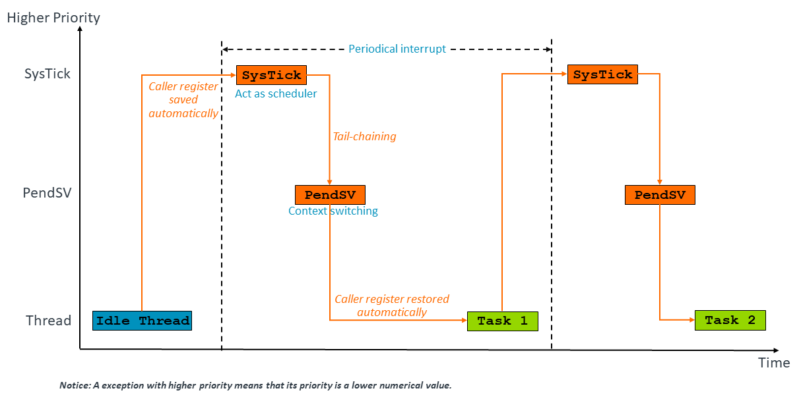
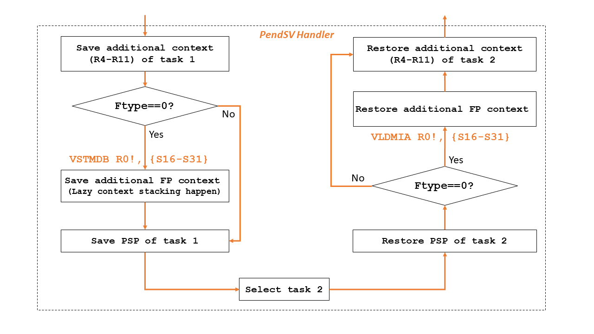

# Example Project - context-switch-fp

In a typical operating system, round-robin scheduling can be used to arrange tasks equally using time slices. 
The time slices are defined using a special timer, SysTick, which produces a periodic interrupt. 
When a SysTick exception occurs, a PendSV with a lower priority is triggered to switch contexts and move to the 
next task. When switching contexts, the contents of registers must be saved. Typically, R4-R11 are saved at 
context switching. However, when an FPU is enabled, an extra 34 registers need to be stacked when switching tasks.

Since FPU registers are infrequently used by ISRs, there is an optimization that can be employed to reduce the
overhead of context switching. This optimization is called lazy floating-point state preservation. This 
optimization defers stacking of the FPU registers until a floating-point instruction is used in the exception. 
If no floating-point instructions are used in the ISR, as is often the case, then the FPU registers never need 
to be stacked. Removing the need to push and pop these registers reduces interrupt latency, which is especially 
important for an RTOS.


This example is build using: 
- Arm Development Studio 2022.2
- Arm Compiler for Embedded 6
- Fast Models Fixed Virtual Platforms (FVP) 11.18
- CMSIS 5.9.0 (available in [GitHub repository](https://github.com/ARM-software/CMSIS_5))
- GCC Toolchain version:10.3

## Purpose and scope

This example shows how to use the SysTick exception to switch tasks, and demonstrates the lazy floating-point 
state preservation optimization. It is a simplification of what a real RTOS does, to illustrate how context switching is performed.

More details about this example can be found in Chapter:Use-Case-Examples of [Armv8-M Exception Model User Guide](https://developer.arm.com/documentation/107706/latest/)

## Building the example

This example can be built with Arm Compiler for Embedded 6 using the supplied Eclipse project.

To import this project, follow the guidelines in the section ["Import an existing Eclipse project" in the Arm Development Studio Getting Started Guide](https://developer.arm.com/documentation/101469/2022-1/Projects-and-examples-in-Arm-Development-Studio/Importing-and-exporting-projects/Import-an-existing-Eclipse-project?lang=en). 

To build the projects within the IDE:

1. In the Project Explorer view, select the project you want to build.
2. Select Project → Build Project.

This example is intended to be built with Arm Compiler for Embedded 6. If you wish to modify and rebuild the example, you must use Arm Compiler for Embedded 6 to rebuild it.

## Running the example

The executable is intended for running on an Armv8-M FVP model supplied with Arm Development Studio. A ready-made launch configuration *context-switch-fp.launch* is provided.

1. Select Run → Debug Configurations....
2. Select *context-switch-fp* from the list of Generic Arm C/C++ Application configurations.
3. Click on Debug to start debugging. The executable image will be downloaded to the target and the program counter set to `main`.
4. Run the executable (press F8). Text output appears in the Target Console view.

> [NOTE]In Breakpoints view at Arm DS, you can use the "Manage Signals" feature to trap exceptions in Debugger. Code execution will stop when a selected exception occurs, so you can clearly see exactly when an exception occurs. 

Additional Material:

[Arm Development Studio Getting Started Guide](https://developer.arm.com/documentation/101469)

[Arm Development Studio User Guide](https://developer.arm.com/documentation/101470)

[Arm Development Studio Debugger Command Reference](https://developer.arm.com/documentation/101471)

## Output in Target Console:

The execution flow can be seen at the following figure.


When SysTick exception happens, the state context including R0-R3, R12, LR, PC and xPSR will be stacked into PSP automatically and the space for FPU state context (S0-S15, FPSCR and VPR if MVE is implemented) will be reserved. At SysTick_handler, we trigger a PendSV with lower priority to complete context switching. So the whole process will be executed periodically.  

The context switching is implemented in the PendSV_Handler() like the following figure.

The additional context (R4-R11 and S16-S31) will be saved manually. With pushing context into stack, the PSP is decreased, so the pointer address will be recorded finally in order to executing the next context switching. Then, select the next task and restore its context step by step.


Showing the following output in target console:

```
Example Project: context-switch-fp Start
Start Scheduler ! 

we are in SysTick handler ! 

The diagonal of a square with side=1: 0.000000 

The diagonal of a square with side=2: 1.414214 

The diagonal of a square with side=3: 2.828427 

The diagonal of a square with side=4: 4.242641 
we are in SysTick handler ! 

The area of a circle with r=2: 3.141593 

The area of a circle with r=3: 12.566371 

The area of a circle with r=4: 28.274334 

The area of a circle with r=5: 50.265484 

...
 ```

The first output of SysTick handler shows the program switches to task1 from main thread. Then, like a Round-Robin scheduling, the two task with main thread are done in a circular order. 
 
 ...[Note]: There is no guarantee that the messages in output stream are completed. You mostly see the messages are interrupted into pieces because different tasks will try to use one sharing output.

## Extension - build and run example with GCC 

   Import the project firstly, right-click the project, select Properties -> C/C++ Build -> Tool Chain Editor. We can switch to the GCC compiler at Current toolchain option. Then, accroding to the build_gcc.sh at scripts folder, we need to re-configure the build setting. Finally, Select Project → Build Project.

   To run the example at FVP, we can follow the steps of 'Running the example' section. But it is important to import the paddron.ds at scripts folder to Debugger interface, which makes sure the data is loaded right. 

   ```
   // paddron.ds
   set elf load-segments-at-p_paddr on
   ```
