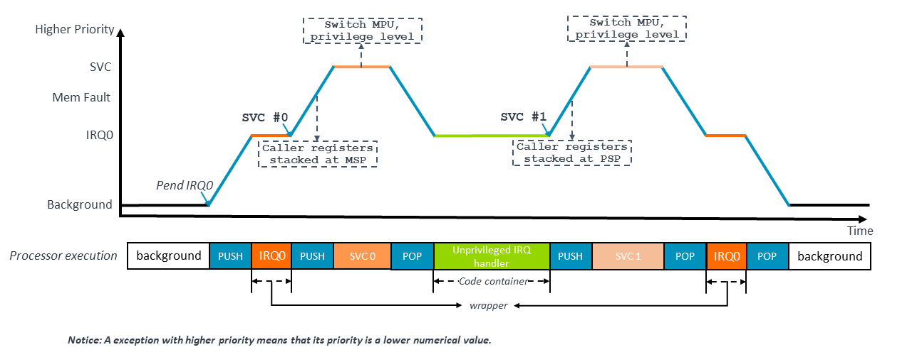
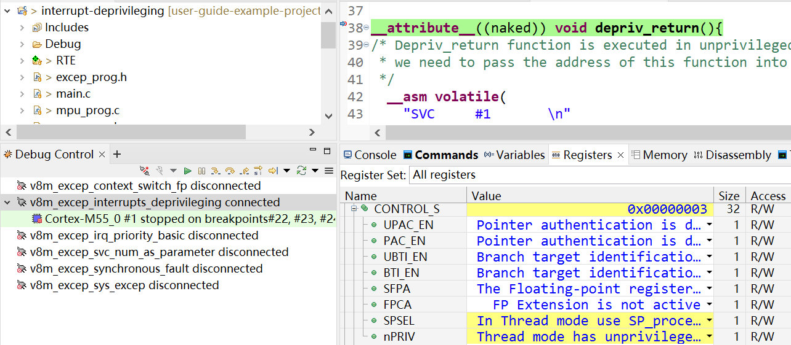

# Example Project - interrupt-deprivileging

This example demonstrates the simple achievement of interrupt deprivileging. Unprivileged thread program can be placed at independent domains and be limited access to memory and peripherals. To enable services of peripherals where some of the peripherals communicate via interrupts, it is important to provide partitions as a mean to handle interrupts along with isolation levels. In order to keep the isolation levels complete, interrupts are isolated using concept of deprivileging interrupt to create a sandbox. (The specific description can be seen at this web[1]).
[1] https://developer.arm.com/documentation/ka001384/latest

To guarantee that the example works, the same versions of the tools must be used. The example may work using other versions of the tools but it is not guaranteed. This example project was created, built and run using:

- Arm Development Studio 2022.2
- Arm Compiler for Embedded 6
- Fast Models Fixed Virtual Platforms (FVP) 11.18
- CMSIS 5.9.0 (available in [GitHub repository](https://github.com/ARM-software/CMSIS_5))

## Purpose and scope

This example aims to show:

- Implementing the privileged interrupts deprivileging via a SVC exception. 

More details about this example can be found in Armv8-M Exception Handling User Guide - chapter:5 - Use case examples

## Building the example

This example can be built with Arm Compiler for Embedded 6 using the supplied Eclipse project.

To import this project, follow the guidelines in the section ["Import an existing Eclipse project" in the Arm Development Studio Getting Started Guide](https://developer.arm.com/documentation/101469/2022-1/Projects-and-examples-in-Arm-Development-Studio/Importing-and-exporting-projects/Import-an-existing-Eclipse-project?lang=en). 

To build the projects within the IDE:

1. In the Project Explorer view, select the project you want to build.
2. Select Project → Build Project.

This example is intended to be built with Arm Compiler for Embedded 6. If you wish to modify and rebuild the example, you must use Arm Compiler for Embedded 6 to rebuild it.

## Running the example

The executable is intended for running on an Armv8-M FVP model supplied with Arm Development Studio. A ready-made launch configuration *interrupt-deprivileging.launch* is provided.

1. Select Run → Debug Configurations....
2. Select *interrupt-deprivileging* from the list of Generic Arm C/C++ Application configurations.
3. Click on Debug to start debugging. The executable image will be downloaded to the target and the program counter set to `main`.
4. Run the executable (press F8). Text output appears in the Target Console view.

Additional Material:

Arm Development Studio Getting Started Guide
https://developer.arm.com/documentation/101469

Arm Development Studio User Guide
https://developer.arm.com/documentation/101470

Arm Development Studio Debugger Command Reference
https://developer.arm.com/documentation/101471

## Output in Target Console:

The execution flow can be seen at the following figure.


At this case, an IRQ exception will be enabled. At its handler, it will act as a wrapper to create an unprivileged code container. 

A SVC0 exception is triggered at IRQ handler. At SVC0 handler, the deprivileging is achieved by switching into PSP and unprivileged mode, and the EXC_RETURN will be refreshed to make sure the execution will into unprivileged thread mode with PSP after SVC0 exception return. 

After exception return, the program is unprivileged thread mode, but still running with the execution priority of the IRQ. This can also be considered as a sandbox executing in unprivileged mode.

A SVC1 exception is triggered after finishing SVC0 exception. At SVC1 handler, the related registers and configuration such as stack pointer, MPU and privileged mode will be restored to wind back to IRQ handler.

After finishing the SVC1, the program needs to be restored to the state before entering IRQ exception.

Here, two breakpoints are set. 

The first one is before entering IRQ exception. The program will stop at handler mode, and the control register is 0x0, seen as the picture .

The second one is before entering SVC1 exception. The program will finish the deprivileging service and print the state when executing this. Returning from SVC0 handler, the program is at sand-box, and the mode and SP has been changed and the program will stop at unprivileged thread mode, so the control register is 0x3, seen as the picture .

The status will be printed in target console:
```
we are in deprivileging thread mode !
```

After all exception completed, the state is restored to 0x0 as we set the background sequence in the privileged mode.
Showing the following output in target console:

 ```
Example Project: interrupt-deprivileging Start
we are in deprivileging thread mode !
we are back from IRQ!
The status is 0xc 
Example Project: interrupt-deprivileging End
 ```
 
*Note: 
 - control register : bit[1] Stack-pointer select, 0 is to use MSP, 1 is to use PSP. 
                      bit[0] not privileged, 0 is for privileged access, 1 is for unprivileged access.
 - Configuration and control register : At Arm v7m, the CCR.NONBASETHRDENA bit is to control whether the processor can enter Thread mode at execution priority level by a fake exception return. If we want to test this example at device based on Arm v7m architecture, we are supposed to enable this bit. Details can be seen from [exception return behavior of Arm v7m](https://developer.arm.com/documentation/ddi0403/d/System-Level-Architecture/System-Level-Programmers--Model/ARMv7-M-exception-model/Exception-return-behavior?lang=en).
    
