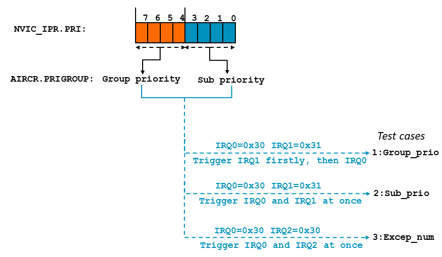

# Example Project - irq-priority-basic

This example demonstrates the concepts available in Nested Interrupt Vector Controller (NVIC) of Cortex-M processors. 

This example is built using:
- Arm Development Studio 2022.2
- Arm Compiler for Embedded 6
- Fast Models Fixed Virtual Platforms (FVP) 11.18
- CMSIS 5.9.0 (available in [GitHub repository](https://github.com/ARM-software/CMSIS_5))
- GCC Toolchain version:10.3

## Purpose and scope

This example aims to show:

- Basic programming of interrupts.
- Configuring stack pointers and stack limit registers.
- Setting up priorities, creating nested exceptions.
- Observing the preemption and tail-chaining behavior of nested exceptions.
- Meaning of vector table and how to reconfigure it.
- Effect of group priority and sub priority.

More details about this example can be found in Chapter:Use-Case-Examples of [Armv8-M Exception Model User Guide](https://developer.arm.com/documentation/107706/latest/)

## Building the example

This example can be built with Arm Compiler for Embedded 6 using the supplied Eclipse project.

To import this project, follow the guidelines in the section ["Import an existing Eclipse project" in the Arm Development Studio Getting Started Guide](https://developer.arm.com/documentation/101469/2022-1/Projects-and-examples-in-Arm-Development-Studio/Importing-and-exporting-projects/Import-an-existing-Eclipse-project?lang=en). 

To build the projects within the IDE:

1. In the Project Explorer view, select the project you want to build.
2. Select Project → Build Project.

This example is intended to be built with Arm Compiler for Embedded 6. If you wish to modify and rebuild the example, you must use Arm Compiler for Embedded 6 to rebuild it.

## Running the example

The executable is intended for running on an Armv8-M FVP model supplied with Arm Development Studio. A ready-made launch configuration *irq-priority-basic.launch* is provided.

1. Select Run → Debug Configurations....
2. Select *irq-priority-basic* from the list of Generic Arm C/C++ Application configurations.
3. Click on Debug to start debugging. The executable image will be downloaded to the target and the program counter set to `main`.
4. Run the executable (press F8). Text output appears in the Target Console view.

> [NOTE]In Breakpoints view at Arm DS, you can use the "Manage Signals" feature to trap exceptions in Debugger. Code execution will stop when a selected exception occurs, so you can clearly see exactly when an exception occurs. 

Additional Material:

[Arm Development Studio Getting Started Guide](https://developer.arm.com/documentation/101469)

[Arm Development Studio User Guide](https://developer.arm.com/documentation/101470)

[Arm Development Studio Debugger Command Reference](https://developer.arm.com/documentation/101471)

## Output in Target Console:

We create a new vector table at SRAM region and reconfigure VTOR to locate the new vector table. For each IRQ handler, we set them as a global function and call different sub routine like trigger IRQ1 at IRQ0 handler based on the IPSR value.

```
Example Project: irq-priority-basic Start
Vector table address is 0x00000000
The IRQ0's vector address is 0x00000040
New vector table address is 0x20000300
The new IRQ0's vector address is 0x20000340
```

VTOR is Vector Table Offset Register, which holds the vector table address. As the default configuration of VTOR is 0x0000_0000, it means the vector table locates in ROM region. The IRQ0 handler is offset 0x0000_0040.

> [NOTE]In a PE with a configurable vector table base, the vector table is naturally-aligned to a power of two, with an alignment value that is:
> - A minimum of 128 bytes.
> - Greater than or equal to (Number of Exceptions supported x4).

Consider the following cases:

- Case:1 - IRQ preemption behavior. We set priority level of IRQ2 > IRQ1 > IRQ0. (Higher priority level means a lower numercial value). Then trigger IRQ0, IRQ1 and IRQ2 in turn, in which we will observe the preemption of IRQ1 and IRQ2. Showing the following output in target console:

```
We are in IRQ 0 Handler!
Setting IRQ 1 to pend 
We are in IRQ 1 Handler!
Setting IRQ 2 to pend 
We are in IRQ 2 Handler!
There is more than one active exception. 
The number of the highest priority active exception is 18 
There is more than one active exception. 
The number of the highest priority active exception is 17 
There is only one active exception. 
The number of the highest priority active exception is 16 
Case:1 is completed!   
```

Because the IRQ1's priority is higher than IRQ0's and the IRQ2's is higher than IRQ1's, the IRQ2 will preempt IRQ1 and IRQ1 will preempt IRQ0 according the executing turn.
As we read the SCB->ICSR and get the status of each IRQ, the output shows IRQ2 is handled firstly, then IRQ1 and IRQ0.


- Case:2 - Tail-chaining behavior. We set priority level of IRQ0 > IRQ1 > IRQ2 and try to trigger all IRQs. Based on the priorities and turn of IRQs, tail-chaining will be observed. Showing the following output in target console

```
We are in IRQ 0 Handler!
Setting IRQ 1 to pend 
Setting IRQ 2 to pend 
The number of the highest priority pending exception is 17 
There is only one active exception. 
The number of the highest priority active exception is 16 
We are in IRQ 1 Handler!
The number of the highest priority pending exception is 18 
There is only one active exception. 
The number of the highest priority active exception is 17 
We are in IRQ 2 Handler!
There is only one active exception. 
The number of the highest priority active exception is 18 
Case:2 is completed!  
```
As we trigger all IRQs at once firstly, the program will handle interrupts according to their priority level. Because the IRQ0 is the highest, it will be handler firstly. In IRQ0 handler, the active interrupt is 16(IRQ0) and the highest priority pending exception is 17(IRQ1).
In IRQ1 and IRQ2 handler, the same behavior will be observed.


- Case:3 - Effect of group priority and sub priority. We set the AIRCR.PRIGROUP with 3, which means the NVIC_IPR.PRI will be divided into two parts. The highest 4 bits is group priority field, and the lowest 4 bits is sub priority field. (Notice: we set PriorityBits with 8, so all the 8 bits of NVIC_IPR.PRI will be used as priority setting). with priority setting IRQ0 = 0x30, IRQ1 = 0x31 and IRQ2 = 0x30, we trigger 3 IRQs in different ways to observe the effect of group priority and sub priority on preemption and tail-chaining behavior. 


Showing the following output in target console

  - GroupPrio_test:
```
We are in IRQ 1 Handler!
Setting IRQ 0 to pend 
The number of the highest priority pending exception is 16 
There is only one active exception. 
The number of the highest priority active exception is 17 
We are in IRQ 0 Handler!
There is only one active exception. 
The number of the highest priority active exception is 16 
Group priority test is completed!
```
Because the preemption only depends on group priority, with same group priority of IRQ0 and IRQ1, although the sub priority of IRQ0's is lower than IRQ1's, the preemption won't happen. So, triggering IRQ0 at IRQ1 handler, the program handles these two IRQs according the tail-chaining behavior.


  - SubPrio_test:
```
We are in IRQ 0 Handler!
The number of the highest priority pending exception is 17 
There is only one active exception. 
The number of the highest priority active exception is 16 
We are in IRQ 1 Handler!
There is only one active exception. 
The number of the highest priority active exception is 17 
Sub priority test is completed!
```
From the result, we can observe that if multiple pending exceptions have the same group priority field value, the pending exception with the lowest subpriority field value takes precedence. Two IRQs are generated at once, and IRQ0 is handled firstly because of lower sub priority.


  - ExcepNum_test:
```
We are in IRQ 0 Handler!
The number of the highest priority pending exception is 18 
There is only one active exception. 
The number of the highest priority active exception is 16 
We are in IRQ 2 Handler!
There is only one active exception. 
The number of the highest priority active exception is 18 
Exception number test is completed! 
Case:3 is completed! 
Example Project: irq-priority-basic End
```
From the result, we can observe that if multiple pending exceptions have the same group priority field value and the same subpriority field value, the pending exception with the lowest exception number takes precedence. Also, two IRQs are generated at once, and IRQ0 is handled firstly because of lower exception number.

## Extension - build and run example with GCC 

In addition to build with Arm compiler for embedded, the projects can also be built with GCC compiler. 

   Import the project firstly, right-click the project, select Properties -> C/C++ Build -> Tool Chain Editor. We can switch to the GCC compiler at Current toolchain option. Then, accroding to the build_gcc.sh at scripts folder, we need to re-configure the build setting. Finally, Select Project → Build Project.

   To run the example at FVP, we can follow the steps of 'Running the example' section. But it is important to import the paddron.ds at scripts folder to Debugger interface, which makes sure the data is loaded right. 

   ```
   // paddron.ds
   set elf load-segments-at-p_paddr on
   ```


