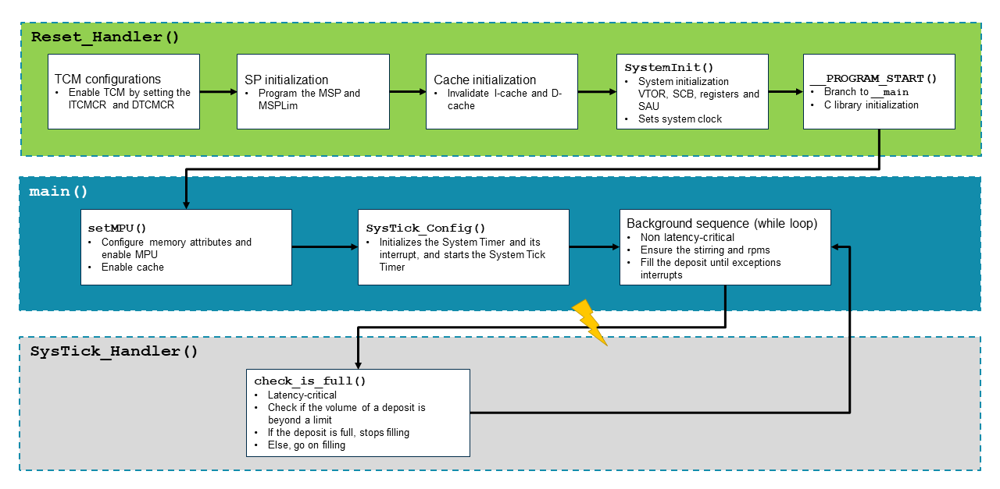

# TCM_implement

Tightly Coupled Memory (TCM) provides low-latency memory access. It can be used to hold time-critical routines, such as interrupt handlers and real-time tasks where the indeterminacy of a cache is undesirable. In addition, TCM can be used to hold critical data structures like interrupt stacks.

This example aims to show:

How to enable the TCM.
How to place latency-critical code in ITCM and latency-critical data in DTCM.

This example is built using: 
- Arm Development Studio 2022.2
- Arm Compiler for Embedded 6
- Fast Models Fixed Virtual Platforms (FVP) 11.18
- CMSIS 5.9.0 (available in [GitHub repository](https://github.com/ARM-software/CMSIS_5))
- GCC Toolchain version:10.3

## Purpose and scope

This example shows how to create software that uses TCMs for latency critical code, while the rest of the code is placed in cacheable memory. Cortex-M55 is the target used for this example, as the Cortex-M55 processor can optionally include Tightly Coupled Memories (TCMs).

This example simulates a simple deposit mechanism as shown in the following diagram:



In this mechanism, the container is filled using the inlet nozzle, and emptied using an outlet nozzle. If the container is full and about to spill over, then the inlet should be stopped and the outlet opened. Periodically, the volume of the deposit in the container should be checked so that the inlet and outlet nozzle can be controlled properly.

To achieve the objective of simulating this deposit mechanism, the example is divided into two sections:

- Latency-critical code
- Non-latency critical code

To check the volume of the deposit in the container, a SysTick Timer is configured to trigger a SysTick exception periodically. In the SysTick handler, the volume of the deposit is checked. Because it is important to take immediate action if the container is about to spill over, the SysTick handler checks should be executed as soon as possible. Therefore the SysTick handler is considered latency-critical, and located at ITCM. However, other code sequences are not considered latency-critical, and can be placed in normal RAM and ROM.

This example is intended to be built with Arm Compiler for Embedded 6.

The executable is intended for running on an Arm Cortex-M55 FVP model supplied with Arm Development Studio.

A ready-made launch configuration *TCM_implement.launch* is provided.

## Project structure

To import this project, follow the guidelines in the section ["Import an existing Eclipse project" in the Arm Development Studio Getting Started Guide](https://developer.arm.com/documentation/101469/2022-1/Projects-and-examples-in-Arm-Development-Studio/Importing-and-exporting-projects/Import-an-existing-Eclipse-project?lang=en). 

The source files structure of this example project is here shown:

```
│   check_is_full.c
│   main.c
│   mpu_defs.h
│   mpu_prog.c
│   mpu_prog.h
│   Excep_prog.c
│   Excep_prog.h
└───RTE
    │   RTE_Components.h
    └───Device
        └───ARMCM55
                ARMCM55_ac6.sct
                startup_ARMCM55.c
                system_ARMCM55.c
```

- **main.c**: Sets the MPU, enables caches, sets up SysTick exception. It contains a loop with non-latency critical code for controlling the stirring of the deposit. 
- **mpu_prog.c**: MPU regions programming.
- **Excep_prog.c**: Relocation of vector table. For new vector table, it locates at ITCM.
- **mpu_defs.h**: Definitions for MPU region attributes.
- **check_is_full.c**: Latency critical function that checks deposit level to set a flag to stop or continue filling the deposit. It also contains the SysTick handler with the latency critical code to control filling of the deposit.
- **RTE/Device/ARMCM55/startup_ARMCM55.c**: Vector table, interrupt/exception handlers. Reset handler in which ITCM and DTCM are enabled and caches are invalidated before branching to `main`.
- **RTE/Device/ARMCM55/ARMCM55_ac6.sct**: Scatter file.
- **RTE/Device/ARMCM55/system_ARMCM55.c**: Target definitions.

## Building the example

This example can be built with Arm Compiler for Embedded 6 using the supplied Eclipse project.

To build the supplied projects within the IDE:

1. In the Project Explorer view, select the project you want to build.
2. Select Project → Build Project.

## Running the example

1. Select Run → Debug Configurations....
2. Select *TCM_implement.launch* from the list of Generic Arm C/C++ Application configurations.
3. Click on Debug to start debugging. The executable image will be downloaded to the target and the program counter set to the entry point of the application.
4. Run the executable (press F8). Text output appears in the Target Console view.

> [NOTE]In Breakpoints view at Arm DS, you can use the "Manage Signals" feature to trap exceptions in Debugger. Code execution will stop when a selected exception occurs, so you can clearly see exactly when an exception occurs. 

Additional Material:

[Arm Development Studio Getting Started Guide](https://developer.arm.com/documentation/101469)

[Arm Development Studio User Guide](https://developer.arm.com/documentation/101470)

[Arm Development Studio Debugger Command Reference](https://developer.arm.com/documentation/101471)


## Output in Target Console:

This is part of the output in the Target Console view shown when running this example:

```
Example Project: TCM-implement Start
Vector table address is 0x10000000
New vector table address is 0x00000000
Current revolutions per minute: 15 
Current revolutions per minute: 30 
Current revolutions per minute: 45 
Current revolutions per minute: 60 
Current revolutions per minute: 75 
Current revolutions per minute: 90 
Current revolutions per minute: 105 
Current revolutions per minute: 0 
Current revolutions per minute: 15 
Current revolutions per minute: 30 
Current revolutions per minute: 45 
Current revolutions per minute: 60 
Current revolutions per minute: 75 
Current revolutions per minute: 90 
Current revolutions per minute: 105 
Current revolutions per minute: 0 
Current revolutions per minute: 15 
Current revolutions per minute: 30 
Current revolutions per minute: 45 
Current revolutions per minute: 60 
Current revolutions per minute: 75 
Current revolutions per minute: 90 
Current revolutions per minute: 105 
Current revolutions per minute: 0 
Current revolutions per minute: 15 
Current revolutions per minute: 30 
Current revolutions per minute: 45 
Current revolutions per minute: 60 
Current revolutions per minute: 75 
Current revolutions per minute: 90 
Current revolutions per minute: 105 
Current revolutions per minute: 0 
Current revolutions per minute: 15 
Current revolutions per minute: 30 
Current revolutions per minute: 45 
Current revolutions per minute: 60 
CurrNumber of checks in SysTick handler: 0 
```

From the output, the monitoring of the deposit system will be observed. For each minutes, the revolutions will be printed and if it is over the maximum revolution, it will be zero, which means we can not store anything into the system. SysTick exception is triggered to check if the deposit is full periodically. The current volume and the number of exception will be printed.

## Running the project in MPS3-Board - AN555

For executing the project at AN555 image (Cortex-M85), the memory regions need to be changed, which will follow the memory map in AN555 image. 

Once we relocate the VTOR at real board, the booting address for next execution will be changed too. If Arm DSTREM debugger is not connected, then the booting address will be read from board configuration file. Hence it is important that booting address is changed manually in board configuration file.

With the above changes, open the semihosting debug in the ArmDS project, connect with debugger and the following output will be shown in the app console:

```
Arm MPS3 FPGA Prototyping Board Test Suite
Version 1.2.6 Build date: Jun  9 2023
Copyright (C) Arm Ltd 2023. All rights reserved.

Program started.
Vector table address is 0x11000000
New vector table address is 0x10000000
Current revolutions per minute: 15 
Current revolutions per minute: 30 
Current revolutions per minute: 45 
Current revolutions per minute: 60 
Current revolutions per minute: 75 
Current revolutions per minute: 90 
Current revolutions per minute: 105 
Current revolutions per minute: 0 
Current revolutions per minute: 15 
Current revolutions per minute: 30 
Current revolutions per minute: 45 
Current revolutions per minute: 60 
Current revolutions per minute: 75 
Current revolutions per minute: 90 
Current revolutions per minute: 105 
Current revolutions per minute: 0 
Current revolutions per minute: 15 
Current revolutions per minute: 30 
Current revolutions per minute: 45 
Current revolutions per minute: 60 
Current revolutions per minute: 75 
Current revolutions per minute: 90 
Current revolutions per minute: 105 
Current revolutions per minute: Number of checks in SysTick handler: 0 
...
```

## Extension - build and run example with GCC 

   Import the project firstly, right-click the project, select Properties -> C/C++ Build -> Tool Chain Editor. We can switch to the GCC compiler at Current toolchain option. Then, accroding to the build_gcc.sh at scripts folder, we need to re-configure the build setting. Finally, Select Project → Build Project.

   To run the example at FVP, we can follow the steps of 'Running the example' section. But it is important to import the paddron.ds at scripts folder to Debugger interface, which makes sure the data is loaded right. 

   ```
   // paddron.ds
   set elf load-segments-at-p_paddr on
   ```
